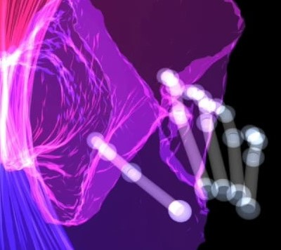
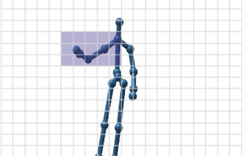
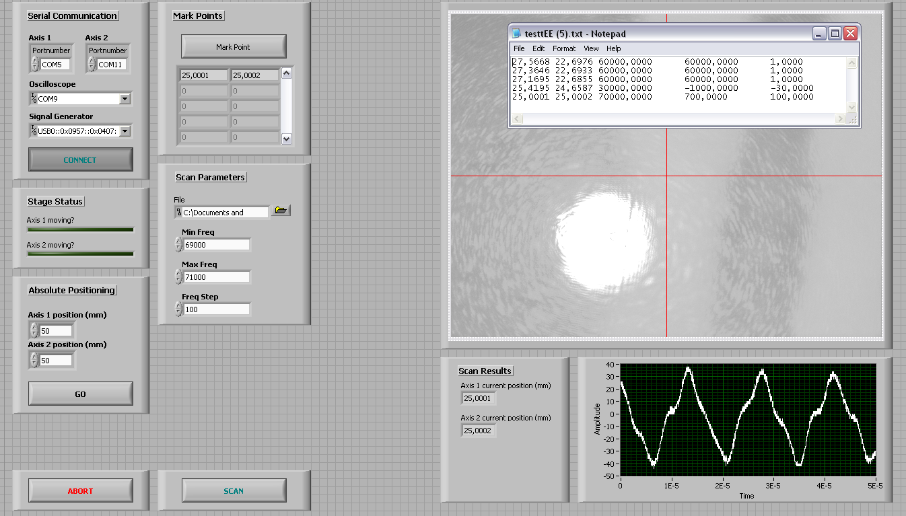
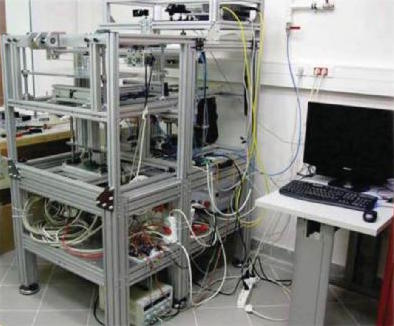

# research

## projects

  

    
  

  

    <a href="/research/mocap/">
      <h4 class="media-heading">
        understanding interpersonal communication through motion capture
      </h4>  
    </a>
    

The goal of this project is to study and propose novel motion tracking technologies to efficiently perceive human gesture, initially focusing on supporting research in linguistics and deictic communication. This involves exploring solutions to specific issues that researchers encounter. Beyond addressing the needs of linguistics researchers, knowledge created through user-centered design processes will inform HCI artifacts for home and work contexts.
    

  

  

    
  

  

    <a href="/research/audio-proprioceptive/">
      <h4 class="media-heading">
        audio-proprioceptive user interfaces
      </h4>  
    </a>
    

Sound is an always-available, fast-acting, and versatile medium for feedback in gesture-based user interfaces. It does not require explicit attention from users, in addition to being computationally and materially cheap to implement. We are conducting experiments to understand the experience of interacting with audio-proprioceptive artifacts, and to understand design considerations for user interfaces that exploit this modality.

  

  

    
  

  

    <a href="/research/techno-perception/">
      <h4 class="media-heading">
        the perception of live-sequenced electronic music via hearing and sight
      </h4>  
    </a>
    

As a prelude to an interaction design project for loop-based, live-sequenced electronic music performances with emotive and legible performer-device interactions; we were interested in the question of how watching a live-sequenced electronic music performance, compared to merely hearing the music, contributes to spectators’ experiences. We explored this via an experiment where participants heard, saw, or both heard and saw a live-sequenced techno music performance recording while they produced continuous judgments on their experience of tension. Our results show that their perception of emotional intensity is consistent across hearing and sight, suggesting that gestures in live-sequencing can be a medium for expressive performance.
    

  

  

    
  

  

    <a href="/research/hotspotizer/">
      <h4 class="media-heading">Hotspotizer</h4>
    </a>
Hotspotizer allows users without computer programming skills to design, visualize, save and recall sets of custom full-body gestures for the Kinect sensor. These gestures are mapped to system-wide keyboard commands which can be used to control any application. Hotspotizer is centered around a novel, easy-to-use graphical interface based on cubic voxels. It is built as an end-to-end, standalone Windows app intended for lay users. A working release of the application and the source code are on GitHub.
  

  

    
  

  

    <a href="/research/biosensor-readout/">
      <h4 class="media-heading">readout automation and GUI for an experimental μ-cantilever-based MEMS biosensor</h4>
    </a>
OML's multi-analyte MEMS biosensor uses an array of coated μ-cantilevers that shift their resonant frequencies upon analyte mass accretion, allowing the detection of analyte concentrations. The cantilevers are magnetically actuated and their resonant frequencies are observed via interferometric optical readout. I designed and implemented a custom GUI and mechanism for setting up characterization experiments by directly manipulating the position of the chip relative to the laser beam. The system then traverses the μ-cantilever array and collects data without supervision.
  

  

    
  

  

    <a href="/research/laser-workstation/">
      <h4 class="media-heading">workstation for laser machining and additive manufacturing</h4>
    </a>
We designed and built a versatile experimental laser manufacturing workstation with marking, cutting, engraving and powder sintering capabilities. The workstation utilizes a 10.6 μm CO2 laser coupled to a 3-axis CNC positioning system, as well as a galvo-driven 1064 nm Nd:YAG laser. The machine is controlled via a custom UI and back-end developed in MATLAB, and an Arduino. The software, which I partly developed, also supports toolpath and G-code generation from STL models. The Arduino and peripheral electronics, which I partly designed and realized, receive user input from the software and control the machine's industrial CO2 laser, AC servos, galvanometric scanner and powder sintering bed mechanism. The chassis is designed, mechanically analyzed, fabricated and hand-assembled by a team of three.
  

## publications

### journal articles

Ünlüer, A.A., Baytaş, M.A., Buruk, O.T., Yemez, Y., Cemalcılar, Z., Özcan, O. (forthcoming) **The effectiveness of mime-based creative drama education for exploring gesture-based user interfaces**. *The International Journal of Art & Design Education*.

### conference papers

Baytaş, M.A., Göksun, T., Özcan, O. (2016) **[The Perception of Live-sequenced Electronic Music via Hearing and Sight](http://www.nime.org/proceedings/2016/nime2016_paper0040.pdf)**. *Proc. NIME.*

Baytaş, M. A., Yemez, Y., Özcan, O. (2014) **[Hotspotizer: end-user authoring of mid-air gestural interactions](http://dl.acm.org/citation.cfm?id=2639255)**. *Proc. NordiCHI.*

### miscellaneous

Baytaş, M.A. (2014) **[End-User Authoring of Mid-Air Gestural Interactions](https://github.com/mbaytas/ma-thesis/releases)**. (MA thesis submitted to the Koç University Graduate School of Social Sciences and Humanities)

Baytaş, M. A., Yemez, Y., Özcan, O. (2014) **[User Interface Paradigms for Visually Authoring Mid-Air Gestures: A Survey and a Provocation](http://ceur-ws.org/Vol-1190/paper2.pdf)**. *Proc. EGMI.*

Özcan, O., Ünlüer, A., Baytaş, M.A., Serim, B. (2012) **[Rethinking Spherical Media Surfaces by Re-reading Ancient Greek Vases](http://displayworkshop.media.mit.edu/ITS2012/downloads/paper-Ozcan.pdf)**. Paper presented at the *ITS '12* workshop *Beyond Flat Displays: Towards Shaped and Deformable Interactive Surfaces*.

## externally funded projects

### as coordinator

Arçelik A.Ş. (2015-2018): "KUAR: Koç University &ndash; Arçelik Research Center for Creative Industries" (&#8378;8.500.000)

### as researcher with administrative responsibilities

FP7-PEOPLE-2012-IAPP (2013-2014): “NaMoCap: Natural Motion Capture Process for Creative Industries” (Grant #324333, &euro;658.000)

TÜBİTAK 1001 (2012-2014): “Specifications on a Design Education Methodology for Gestural Interface Design" (Grant #112E056, &#8378;188.000)

### as researcher

KoçSistem (2012-2013): "Monitoring & Control Center Touchless Gesture 3D Interactive HMI” (&#8378;110.000)

## awards and scholarships

Koç University GSSSH (Graduate School of Social Sciences and Humanities) Fellowship (2014&ndash;2018)

TÜBİTAK 1001 Scholarship (2012&ndash;2014, grant #112E056)

Vehbi Koç Scholarship (2010)

Koç University Merit Scholarship (2007&ndash;2012)

Higher Education Loans and Housing Agency (Yüksek Öğrenim Kredi ve Yurtlar Kurumu) Scholarship (2007&ndash;2011)
